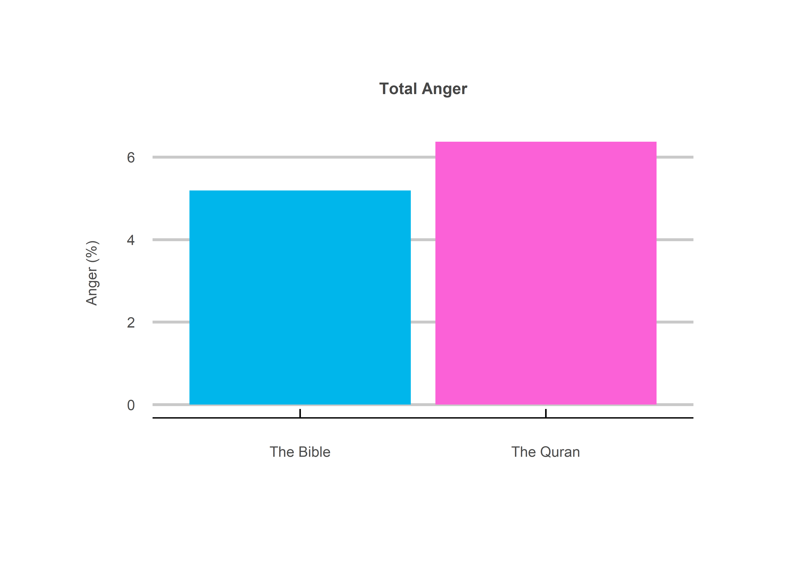

The Wrath of God
================
Jack Carter
6/4/2022

## **Summary**

The holy books are often said to be full of hate. This project uses
sentiment analysis to show how they are not necessarily full of hate,
but simply very emotional. As with the drinking priest in the 1972 film
The Wrath of God, this means they can be prone to significant anger as
well as other more positive emotions.

 

## **1) General**

*1.1 Popular Words:* the Bible appears to refer to the creator as both
God and Lord, while the Quran mainly uses God.

<!-- -->

 

*1.2 Total Words:* the holy books appear to have significantly more
words on average, with the Bible having the most.

<!-- -->

 

*1.3 Distinct Words:* even though the Bible has more words, the Quran
appears to have a greater number of distinct words.

<!-- -->

 

## **2) Sentiment**

*2.1 Israelite Anger:* the Quran appears to be more angry when speaking
about the Israelite people compared to the Bible, possibly reflecting a
greater degree of historical intergroup conflict.

<!-- -->

 

*2.2 Total Anger:* the holy books do not appear to be that angry
compared to others, although the Quran appears to be more angry than the
Bible.

<!-- -->

 

*2.3 Emotion:* the holy books seem to have a greater percentage of
emotional words compared to others, with the Quran having more than the
Bible.

<!-- -->

 

*2.4 Net Sentiment:* the holy books also seem to have a higher net
sentiment than most others, with the Quran having a slightly higher net
sentiment than the Bible.

<!-- -->

 

## **Disclaimer**

While the data above may suggest the Quran is more angry than the Bible,
it is important to remember it is also more emotional and actually has a
higher net sentiment. Both the Bible and the Torah also contain their
share hateful language towards other outside groups they perceived as a
threat which did not survive until this day (the Canaanites, Moabites,
Amalekites etc.). Additionally, any conclusions made from sentiment
analysis alone are necessarily limited, as this type of analysis does
not take context into account.

 

## **Method**

### **1) Download Books:**

The holy books and a selection of others are downloaded from the Project
Gutenberg library.

—EXAMPLE CODE SNIPET—

``` r
# reads in the holy books from the gutenberg project library.
bible <- gutenberg_download(30) %>%
  mutate(gutenberg_id = "bible")

...

all_books <- bible %>%
  rbind(quran) %>%
  rbind(pride_and_prejudice) %>%
  rbind(communist_manifesto) %>%
  rbind(sherlock_holmes) %>%
  rbind(alice_in_wonderland) %>%
  rbind(the_great_gatsby)
```

 

### **2) Clean Books:**

The holy books and a selection of others are cleaned by removing empty
strings, punctuation and digits, as well as adding a column for biblical
vs non-biblical and line number.

—EXAMPLE CODE SNIPET—

``` r
# renames the columns. 
names(all_books) <- c("book","text")

# drops all the empty strings. 
all_books <- all_books[all_books$text !="",]

# cleans all digits and punctuation. 
all_books$text <- gsub('[[:punct:]]|[[:digit:]]','',all_books$text)

# adds a biblical/not biblical and line number column. 
final_df <- all_books %>%
  mutate(book_type = ifelse(book %in% c("bible", "quran"), "biblical", "non_biblical"),
         line_no = row_number())
```

 

### **3) Get Sentiment:**

Each line is broken down into individual words (tokens), stop words
(common words with little sentiment value) removed and the NRC sentiment
library added via an inner join.

—EXAMPLE CODE SNIPET—

``` r
# breaks the text down into words and filters 
# out words of less than 2 characters. 
words <- df %>%
  unnest_tokens(word, text) %>%
  filter(nchar(word)>2)

# filters out stopwords.
words <- words %>%
  filter(!word %in% stop_words$word)

# joins the words with their sentiment values. 
sentiment <- inner_join(words, get_sentiments("nrc"))
```

 

### **4) Transformation:**

Various techniques are used to manipulate the data for the purpose of
uncovering underlying trends.

—EXAMPLE CODE SNIPET—

``` r
# extracts all words in line numbers matching a certain term. 
get_lines <- function(term) {
  lines <- words %>%
    summarize(words[words$word == term,"line_no"]) %>%
    mutate(label = term)
  return(lines)
}

get_multiple_terms <- function(terms) {
  lines <- list()
  for(i in 1:length(terms))
    lines[[i]] <- get_lines(terms[i])
  df <- tibble(rbind_pages(lines))
  return(df)
}
```

 

### **5) Visualization:**

Finally, the data is visualized with barplots in ggplot2.

—EXAMPLE CODE SNIPET—

``` r
# plots the anger associated with certain terms in the holy books. 
get_anger <- function(data, terms) {
  plot <- data %>% 
    filter(book_type == "biblical") %>%
    left_join(terms, by = "line_no") %>%
    filter(line_no %in% terms$line_no) %>%
    mutate(label = str_to_title(str_replace_all(label, "_", " ")),
           book = str_to_title(book)) %>%
    group_by(book, label) %>%
    mutate(total = length(sentiment)) %>%
    summarize(Anger = ((sum(sentiment=="anger")/total)*100)) %>%
    unique() %>%
    ggplot(aes(x=book,y=Anger,fill=book)) +
    ggtitle(str_to_title(str_replace_all(deparse(substitute(terms)),"_"," "))) +
    geom_bar(stat = "identity", position = "dodge") +
    facet_wrap(~label) +
    xlab("") +
    ylab("Sentiment (%)") +
    my_theme +
    theme(axis.text.x = element_blank(),
          axis.ticks.x = element_blank())
  return(plot)
}
```

 

## **Sources**

  - Firestone (2020)
    <https://www.degruyter.com/document/doi/10.1515/9783110671773-007/html>

  - Project Gutenberg (2022) <https://www.gutenberg.org/>

  - Mohammad (2022)
    <https://saifmohammad.com/WebPages/NRC-Emotion-Lexicon.htm>
