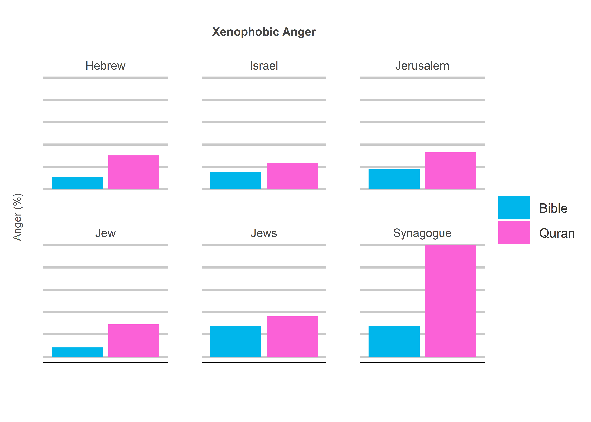

The Wrath of God?
================
Jack Carter
6/4/2022

## **Summary**

The holy books, particularly the Quran, are often said to be full of
hate. This project uses sentiment analysis to show how they are not
necessarily full of hate, but rather very emotional. As with the priest
in The Wrath of God, this means they may be prone to anger, but also
contain a lot of positive emotions as well.

 

## **1) Anger**

1.1) The Quran is more angry than the Bible.

<!-- -->

 

1.2) The Quran is also more angry when speaking about the Israelite
people.

<!-- -->

 

1.3) The Quran is also more angry when speaking about sexual sins.

<!-- -->

 

## **2) Context**

2.1) The holy books are not that angry compared to other popular books.

<!-- -->

 

2.2) Their apparent anger may stem from the fact that they are very
emotional.

<!-- -->

 

2.3 Their net sentiment is actually higher than most other popular
books.

<!-- -->

 

## **Disclaimer**

While the data above may suggest the Quran is more angry than the Bible,
it is important to remember that it is also more emotional and actually
has a higher net sentiment. Additionally, any conclusions made from
sentiment analysis alone are limited, as it does not take context into
account.

 

## **Method**

### **1) Download Books:**

The holy books and a selection of others are downloaded from the Project
Gutenberg library.

—EXAMPLE CODE SNIPET—

``` r
# reads in the holy books from the gutenberg project library.
bible <- gutenberg_download(30) %>%
  mutate(gutenberg_id = "bible")

...

all_books <- bible %>%
  rbind(quran) %>%
  rbind(pride_and_prejudice) %>%
  rbind(communist_manifesto) %>%
  rbind(sherlock_holmes) %>%
  rbind(alice_in_wonderland) %>%
  rbind(the_great_gatsby)
```

 

### **2) Clean Books:**

The holy books and a selection of others are cleaned by removing empty
strings, punctuation and digits, as well as adding a column for biblical
vs non-biblical and line number.

—EXAMPLE CODE SNIPET—

``` r
# renames the columns. 
names(all_books) <- c("book","text")

# drops all the empty strings. 
all_books <- all_books[all_books$text !="",]

# cleans all digits and punctuation. 
all_books$text <- gsub('[[:punct:]]|[[:digit:]]','',all_books$text)

# adds a biblical/not biblical and line number column. 
final_df <- all_books %>%
  mutate(book_type = ifelse(book %in% c("bible", "quran"), "biblical", "non_biblical"),
         line_no = row_number())
```

 

### **3) Get Sentiment:**

Each line is broken down into individual words (tokens), stop words
(common words with little sentiment value) removed and the NRC sentiment
library added via an inner join.

—EXAMPLE CODE SNIPET—

``` r
# breaks the text down into words and filters 
# out words of less than 2 characters. 
words <- df %>%
  unnest_tokens(word, text) %>%
  filter(nchar(word)>2)

# filters out stopwords.
words <- words %>%
  filter(!word %in% stop_words$word)

# joins the words with their sentiment values. 
sentiment <- inner_join(words, get_sentiments("nrc"))
```

 

### **4) Transformation:**

Various techniques are used to manipulate the data for the purpose of
uncovering underlying trends.

—EXAMPLE CODE SNIPET—

``` r
# extracts all words in line numbers matching a certain term. 
get_lines <- function(term) {
  lines <- words %>%
    summarize(words[words$word == term,"line_no"]) %>%
    mutate(label = term)
  return(lines)
}

get_multiple_terms <- function(terms) {
  lines <- list()
  for(i in 1:length(terms))
    lines[[i]] <- get_lines(terms[i])
  df <- tibble(rbind_pages(lines))
  return(df)
}
```

 

### **5) Visualization:**

Finally, the data is visualized with barplots in ggplot2.

—EXAMPLE CODE SNIPET—

``` r
# plots the anger associated with certain terms in the holy books. 
get_anger <- function(data, terms, book_Type=NULL) {
  plot <- data %>% 
    filter(book_type == book_Type) %>%
    left_join(terms, by = "line_no") %>%
    filter(line_no %in% terms$line_no) %>%
    mutate(label = str_to_title(str_replace_all(label, "_", " ")),
           book = str_to_title(book)) %>%
    group_by(book, label) %>%
    mutate(total = length(sentiment)) %>%
    summarize(Anger = ((sum(sentiment=="anger")/total)*100)) %>%
    unique() %>%
    ggplot(aes(x=book,y=Anger,fill=book)) +
    ggtitle(str_to_title(str_replace_all(deparse(substitute(terms)),"_"," "))) +
    geom_bar(stat = "identity", position = "dodge") +
    facet_wrap(~label) +
    xlab("") +
    ylab("Sentiment (%)") +
    my_theme +
    theme(axis.text.x = element_blank(),
          axis.ticks.x = element_blank())
  return(plot)
}
```

 

## **Sources**

  - Firestone (2020)
    <https://www.degruyter.com/document/doi/10.1515/9783110671773-007/html>

  - Project Gutenberg (2022) <https://www.gutenberg.org/>

  - Mohammad (2022)
    <https://saifmohammad.com/WebPages/NRC-Emotion-Lexicon.htm>
